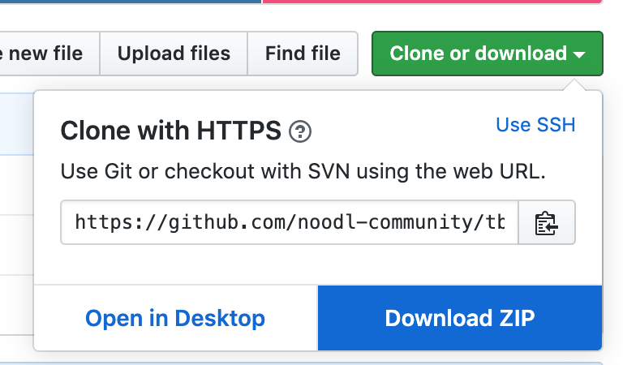
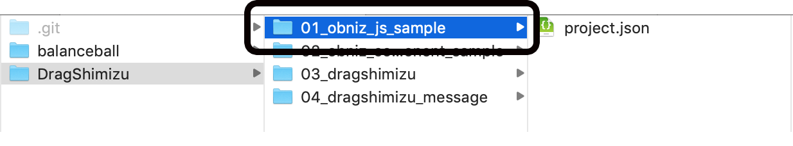

# 『麺書』サンプル

本リポジトリは、「技術書典 応援祭」にて頒布予定の『麺書』のサンプルを収録したリポジトリです。

## 内容

 ディレクトリ                 | 対応する章
----------------------------|-----------
|[XXX](XXX)                 |第2章 受付嬢（システム）をプロトタイピング！|
|[balanceball](balanceball) |第3章 Ongaq.jsとmicro:bitを使ってアゲアゲ⤴︎なものを作ろう|
|[DragShimizu](DragShimizu) |第4章 Noodlからobniz上の清水さんを動かす|
|[abyss](abyss)             |第5章 清水をのぞくとき清水もまたこちらをのぞいているのだ|

## 使用方法
### サンプルのダウンロードまたはクローン

ダウンロードする場合は、リポジトリのページ右上の`Clone or download`ボタンから"Download ZIP"をお選びください。



Gitを導入済みの方は、お好みの場所にクローンしてください。

```sh
 $ git clone https://github.com/noodl-community/tbf08-mensho.git
```

### Noodl2.0のインストール

下記URLを参考に、登録・インストールをしてください。
現在Noodl2.0はクローズドβ版で、使用するには下記URLに記載されている手順に従って登録し、招待を受ける必要があります（2020年2月現在）。

[【Noodl開発者からクリスマスプレゼント!?】 Noodl 2.0ベータ版に参加しよう！ - Qiita](https://qiita.com/noodl-tokyo/items/e8d9e945c60433019026)

### Noodlにプロジェクトをインポートする

* Noodl2.0を立ち上げてログイン
* 「Project」タブをクリック
* 「Import existing project」をクリック
* タイトルを付け、「Pick project folder」をクリック
* インポートしたいサンプルを選択
    * 「project.json」がある階層のひとつ上のディレクトリ（ex:「balanceball」など）を選択してください



### ライセンス
[LICENSE](LICENSE)

### お問い合わせ
サンプルの動作について疑問や報告があれば、[issue](/../../issues/new)を作成してお尋ねください。
